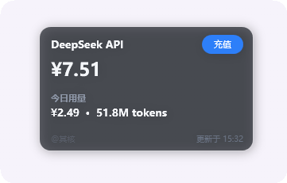

# DeepSeek 余额小组件（Windows）



一个免安装的 Windows 桌面小工具：开机后常驻在桌面右上角，像一个手机小组件，实时显示你的 DeepSeek 余额和今日用量。卡片是 iOS 风格连续曲率圆角的半透明小组件样式，上面只有一个可点击的「充值」按钮，其余区域点击都会穿透到桌面，完全不挡你操作桌面图标和文件。

## 下载安装

前往 **[Releases](https://github.com/qihe114514/DeepSeekWidget/releases)** 下载最新版：

- **安装版（推荐）**：`DeepSeekWidget-Setup-1.6.0.exe`（约 2.2 MB）—— 自动检测并安装 .NET 8 桌面运行时与 WebView2，带开始菜单/桌面快捷方式与卸载项
- **便携版**：`DeepSeekWidget-v1.6.0.zip`（约 0.4 MB）—— 解压后直接运行 `DeepSeekWidget.exe`，需要已安装 .NET 8 桌面运行时与 WebView2 Runtime
## 怎么开始用

1. 双击 `DeepSeekWidget.exe` 运行（建议放到任意目录，比如 `D:\Tools\`）。
2. 右键屏幕右下角托盘的图标，点「**登录 DeepSeek 账号…**」。
3. 在弹出的窗口里登录你的 DeepSeek 账号即可（**不用填 API Key**）。
4. 登录成功后会自动验证并保存，窗口自动关闭，卡片马上开始显示余额和今日用量。

## 卡片上能看到什么

- **余额**：你充值的金额；低于阈值（默认 ¥10）时数字变琥珀色并显示「余额偏低」提示，同时托盘弹一次提醒
- **今日用量**：今天花了多少钱、用了多少 Token
- **近期缓存命中率**：按现有刷新数据估算近 5 或 10 分钟的缓存命中 Token 占比，显示在今日 Token 后方
- **近 7 日趋势**：右下角迷你柱状图，最后一根（今天）为高亮色
- **峰谷时段**：标题旁显示当前是「高峰」还是「空闲」时段（彩色徽标），悬停可见下一次切换时间；距切换不足 2 小时时改为按分钟倒计时
- **更新时间**：显示在卡片下方，旁边是「刷新」按钮，点一下立即刷新
- **「充值」按钮**：点它直接打开充值页面，关闭窗口后自动刷新

卡片会在「加载中 / 未登录 / 登录过期 / 获取失败 / 正常」几种状态间自动切换，未登录或登录过期时会给出「登录 DeepSeek 账号」入口。

## 常用操作（托盘右键菜单）

托盘菜单由 **WinUI 3** 渲染（圆角浮出、亚克力、随系统浅色/深色主题自动切换、子菜单与选中态均为系统原生控件）。菜单项全部使用图标列而不是 WinUI 的勾选列，因此左侧没有多余空距（勾选列会把图标整体右推 28px）。

- **立即刷新**：立刻拉取一次余额与用量（也可以直接**左键单击托盘图标**）
- **位置**：移动位置 / 重置位置 —— 拖动卡片到喜欢的地方，松手即固定；「重置位置」回到默认的右上角
- **窗口层级**：置顶 / 置底 —— 默认置底（不挡其他窗口），需要时可以让它永远浮在最前面；当前生效的那一项显示勾选图标
- **刷新频率**：30 秒 / 1 分钟 / 2 分钟 / 5 分钟 / 10 分钟，随时切换；当前频率显示勾选图标
- **缓存命中率窗口**：近 5 分钟 / 近 10 分钟，随时切换；统计复用现有刷新快照，不额外请求接口。刷新间隔比统计窗口更长时会使用现有样本近似计算
- **不透明度**：20%–100% 调节整张卡片的透明程度（含文字与阴影），适合和壁纸融合
- **缩放比例**：60%–250% 整体等比缩放，卡片、字体与间距一起放大/缩小，不会出现「盒子变小而字没变小」的错位
- **重置**：一键把不透明度与缩放都还原到 100%，即时生效并写回配置
- **开机自启动**：开启后图标变为勾选，每次开机自动显示
- **登录 DeepSeek 账号…**：重新登录，或登录过期时用这个
- **主题**：跟随系统 / 浅色 / 深色，切换后立即生效并记住选择
- **关于 / 退出**

## 小提示

- 卡片是半透明毛玻璃效果，需要系统开启「透明效果」（Windows 设置 → 个性化 → 颜色 → 透明效果）。
- 「今日用量」和「近 7 日趋势」来自平台内部接口，偶尔会随平台改版失效；失效时卡片只显示余额，用量区域会给出提示。
- 余额提醒阈值可在 `%APPDATA%\DeepSeekWidget\config.json` 的 `LowBalanceThreshold` 调整（「关于」窗口里有「打开数据目录」入口）。
- 卸载：托盘取消勾选「开机自启动」→ 点「退出」→ 删除 exe 和 `%APPDATA%\DeepSeekWidget` 文件夹即可。

## 给开发者的构建说明

工程为 **.NET 8（net8.0-windows）+ Windows App SDK（WinUI 3）**：所有可见窗口和控件均由 WinUI 3 渲染；WPF 仅保留进程启动和消息循环兼容层，不再显示任何 WPF 控件。托盘图标使用原生 `Shell_NotifyIcon`，托盘菜单仍为 WinUI 3 `MenuFlyout`。

窗口材质使用 Windows App SDK 的 `DesktopAcrylicBackdrop`，并结合系统圆角与深色标题栏属性；主题切换时所有已打开窗口会即时更新。

在仓库根目录运行 `.\build.ps1`，产物是 `dist\DeepSeekWidget.exe` 及其依赖 DLL（框架依赖发布，需连同 `dist` 目录一起分发）。

构建前置：

- 安装 **.NET 8 SDK**（`winget install Microsoft.DotNet.SDK.8`），或已存在用户级 SDK（`%USERPROFILE%\.dotnet`）时脚本会自动使用
- 运行机器的前置运行时：**.NET 8 Desktop Runtime**；Windows App SDK 采用自包含部署，无需另行安装 Windows App Runtime

也可以直接用 dotnet CLI：

```
dotnet publish DeepSeekWidget.csproj -c Release -r win-x64 --self-contained false -o dist
```

调试参数：`--login` 启动后直接打开登录窗口，`--recharge` 直接打开充值窗口，`--menu` 在屏幕右下角弹出一次托盘菜单，`--about` / `--appearance` 直接打开对应的 WinUI 3 对话框（用于核对外观）。


## 原生单文件安装器

在仓库根目录运行：

```
.\installer-lite\build-native-setup.ps1
```

脚本会构建 WPF 版小体积应用，并生成 Inno Setup 原生安装向导：

```
dist\DeepSeekWidget-Setup-1.6.0.exe
```

安装界面使用 Windows 原生控件，不使用 HTML。应用本体约 2 MB，安装包约 2.2 MB。应用只需要 .NET 8 Desktop Runtime；如果目标机未安装，安装器会从微软官方地址下载并静默安装。WebView2 Runtime 缺失时也会自动下载。

旧的 Windows App SDK / WinUI 版本仍保留在仓库中，但不再作为小体积安装包入口。
